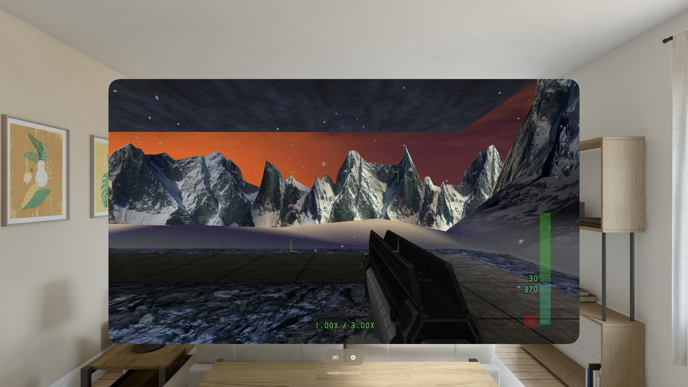

# Perfect Dark for iPhone & Apple Vision Pro

**Perfect Dark** — Rare's N64 shooter — running natively on iPhone, iPad and
Apple Vision Pro. Not an emulator: this is the
[Perfect Dark decompilation](https://github.com/n64decomp/perfect_dark)
compiled for Apple silicon, through the
[Perfect Dark PC port](https://github.com/perfect-dark-pc-port/perfect_dark)
and [Dab's Mod](https://github.com/DabDavis/perfect-dark-dabs-mod), rendering on
Metal.

Dab's Mod is what makes this the version worth porting: jump, a combat roll,
melee combos and a third-person camera the N64 game never had, the Combat
Simulator's simulant cap raised from 8 to **80**, bodies that stay where they
fell — and **XBLA support**, which draws the 2010 Xbox 360 release's
high-resolution textures, meshes, rooms, font and explosions in place of the
N64 art, from your own copy of that release.

On **Apple Vision Pro** there is a stereoscopic **3D mode**: the game on a
world-locked panel floating in your room, in mixed immersion, with foveated
rendering and a live settings sheet you can adjust while you play.

Requires **iOS 15 or later**, or **Apple Vision Pro on visionOS 26 or later**.



---

## Install

**Add the SideStore source** — the easiest path, and the app auto-updates when
new versions ship:

| Device | Source URL |
| --- | --- |
| iPhone / iPad | `https://raw.githubusercontent.com/rebelancap/all-ports/main/apps-ios.json` |
| Apple Vision Pro | `https://raw.githubusercontent.com/rebelancap/all-ports/main/apps-visionos.json` |

In [SideStore](https://sidestore.io) / [AltStore](https://altstore.io):
*Sources → **+** → paste the URL*, then install Perfect Dark. This is a shared
source — it carries the other ports too.

On **Apple Vision Pro**, first install SideStore onto the headset with
[iloader](https://github.com/rebelancap/iloader/releases#release-visionos)
(SideStore/AltStore can't be installed on visionOS the usual way — iloader is
what gets SideStore there). Then add the source in SideStore exactly as above.
No Xcode or Dev Strap required.

**Prefer a manual install?** Download `perfectdark-<VERSION>-iOS.ipa` or
`perfectdark-<VERSION>-visionOS.ipa` from the
[latest release](../../releases/latest) and install it through SideStore /
AltStore yourself (iPhone can also use [Sideloadly](https://sideloadly.io)).

## You bring the game

**The app ships with no game data.** There is no ROM, no textures, no audio and
no Xbox 360 content in this repository or in the IPA — the app reads every
texture, model, level and line of dialogue out of *your* copy at startup.
Dumping it from your own cartridge and your own Xbox 360 purchase is on you;
please don't ask where to find either, and don't post links in the issue
tracker.

### The ROM (required)

You need **Perfect Dark (USA) (Rev 1)** — also called `ntsc-final` or US V1.1,
the one the boot screen calls *NTSC version 8.7 final*:

| | |
| --- | --- |
| Filename | `pd.ntsc-final.z64` |
| md5 | `e03b088b6ac9e0080440efed07c1e40f` |

PAL and JPN ROMs are **not** supported by Dab's Mod, and neither is US 1.0.
The first-run screen checks the file you dropped in and tells you in words which
one you have and why it was rejected.

To install it:

1. Open the **Files** app.
2. Go to **On My iPhone → Perfect Dark** (on the headset: **On My Apple Vision
   Pro → Perfect Dark**).
3. Drop `pd.ntsc-final.z64` straight into that folder (a `data/` subfolder works
   too), then relaunch.

### The Xbox 360 (XBLA) release (optional, and the reason for this fork)

If you own the 2010 Xbox Live Arcade release of Perfect Dark, the app can draw
4J Studios' high-resolution art instead of the N64 art. Put your copy in the
**`added-content`** folder in the same place (the game makes it on its first
launch; an older install's `xbla` folder is moved into it for you):

- the archive as it came, **`.rar`** or **`.7z`** — nested folders inside are
  fine; or
- the bare STFS package file itself.

The first launch after that unpacks it once (around 250 MB, a minute or two on a
phone, with a progress screen) into a cache that iOS is free to purge — if it
goes, the app just unpacks it again. After that, **Settings → Xbox 360 (XBLA) →
Xbox 360 textures and models** turns the whole release on or off; turning it on
reloads the level, the same as pressing **F6** on the desktop build.

### GoldenEye 007 — GE Plus (optional)

Dab's Mod can also play **GoldenEye 007** inside Perfect Dark: its missions,
its arenas in the Combat Simulator with simulants, its folder menus, its music.
Nothing of GoldenEye's is in the app — it is converted from **your own
GoldenEye 007 (US) N64 ROM**. Put the ROM in the same **`added-content`**
folder, under any name (`.z64`, `.n64` or `.v64`), and open the app: the first
launch converts it once (a few seconds, with a notice on screen), and **GE Plus**
appears in the Perfect Menu. Only the US cartridge is accepted.

If you also own the **GoldenEye XBLA** release, put it in `added-content` too,
in whichever form you have it:

- the release's own files in a **`.7z`** or **`.zip`** (or a folder of them,
  with `files/new/char` inside), or
- the **Xbox 360 package** — the single large file the console stores under
  `584108A9/000D0000/` — on its own, in a folder, or in a `.7z` or `.zip`
  (the console's folders inside the archive are fine).

It is unpacked once on the next launch, with a progress notice: about 400 MB
into the app's purgeable cache. An archive holding the package is read
straight through without making a copy of the package, so it needs no more
room than the other forms; keep around 1 GB free, and if there is not enough
the game says how much it needs and tries again next time. Your own file is
never changed. GE Plus then draws its HD characters, levels and guns whenever
the **Xbox 360 textures and models** switch is on. A `.rar` is not read for
GoldenEye; take the package out of it, or repack it as a `.7z`.

Both files are found by what they are, not by their names. You can also add or
replace them from **Settings → GoldenEye 007 (GE Plus)**, which says plainly if
a file is not the right one; changes there take effect the next time you open
the app.

**Goldfinger 64**, the GoldenEye ROM hack, is converted the same way beside GE
Plus and gets its own row in the Perfect Menu — its missions, arenas, guns and
music, with its own folder screens. Put `goldfinger64.zip` (or the `.xdelta`
patch inside it) in `added-content` beside the GoldenEye 007 (US) ROM, which
the patch is applied to; a Goldfinger 64 ROM you have already patched works
too, in any byte order. The next launch converts it once (a few seconds). It
always draws in the N64 look. Settings has an add/replace row for it.

### Everything else, in the same folder

| Path | What it is |
| --- | --- |
| `pd.ntsc-final.z64` | the ROM (or `data/pd.ntsc-final.z64`) |
| `added-content/` | your XBLA archive or package, and optionally a GoldenEye 007 (US) ROM, the GoldenEye XBLA release (archive or package) and Goldfinger 64 |
| `texture-packs/` | texture packs — a folder, or the `.zip`/`.7z` it came in |
| `model-packs/` | model packs, one folder per pack |
| `mods/` | mods and console-mod patches, exactly as downloaded |
| `screenshots/` | screenshots the game writes |
| `pd.ini`, `eeprom.bin` | your settings and your saves |
| `pd.log` | the last run's log |

All of it is visible and editable in the Files app. Your saves and settings are
never inside the game data, so a ROM or XBLA copy can be swapped without losing
anything.

## Controls

**Game controllers are the primary input** — this is a twin-stick console
shooter and it plays best with a pad. Pair any MFi / Xbox / PlayStation
controller and it works; bindings can be changed in the game's own control
options.

**Touch controls** appear automatically when no controller is connected: a
floating move stick anywhere on the left half of the screen, drag on the right
to look, and glyph buttons for **FIRE**, **AIM**, **USE**, **CROUCH**,
**RELOAD**, **SWAP**, the gun's **secondary function** (the Xbox 360 pad's RB),
the **weapon wheel** (LB) and the menu. Hold **AIM** and a second FIRE appears under
your left thumb, so one thumb aims while the other shoots. Hold the **weapon
wheel** button and slide your thumb towards a weapon; let go to pick it. On
GoldenEye levels the secondary-function button is hidden while the gun in hand
has only one function, which is every GoldenEye gun. The secondary-function
button lights up while the gun is on its second function — a pistol whip or
punch has no crosshair, so a missing crosshair means tap it again. **Double-tap
the stick side to combat-roll.** Every button can be dragged and the whole set
scaled — *Settings → Controls → Customize Touch Layout…*. Touch a button there
and an eye appears beside it: tap the eye to hide that button (say, if you use
the weapon wheel instead of swap), tap it again to bring it back. The menu
button cannot be hidden. Reset brings every button back to where it started.

Menus are driven by touch as well: tap a row to select it, exactly as a mouse
would on the desktop build.

## Settings

Tap the gear at the top-left corner. It is there in the menus, the title screen,
the pause menu and briefings, and gets out of the way while you are playing.

- **Aiming** — look speed, vertical look speed, invert look, gamepad look speed.
- **Controls** — control style (dual analogue or N64 digital), on-screen
  controls Auto/On/Off, button opacity, haptics, double-tap-to-roll, and the
  touch layout editor.
- **Display** — frame rate (the panel's own maximum, so 120 Hz on a ProMotion
  iPhone), resolution, and an FPS readout.
- **Audio** — Other App Audio (what happens to music or a podcast while you
  play), volume, mute. The game's own Sound / Music / Sound Mode stay in its
  own Audio Options page.
- **Xbox 360 (XBLA)** — import a package, and the one switch that turns the
  whole release on.
- **GoldenEye 007 (GE Plus)** — what was found of the GoldenEye ROM and the
  GoldenEye XBLA release, and a button to add or replace each.
- **Texture packs** — the packs you have dropped in, and Community Packs.
- **Diagnostics** — live frame rate and the device's thermal state.

Settings persist across relaunches, and the game's own settings and saves are
written whenever the app goes to the background, so a swipe-kill doesn't lose
them.

Everything Dab's Mod adds is still on its own pages inside the game —
**Options → Extended Options → Dab's Mod Options** (Player, Camera, Display,
Missions) — including the simulant cap, persistent bodies, the spectator camera
and the Picture settings.

## Apple Vision Pro

The 2D window is the whole game in a resizable window. Open **3D mode** and it
moves onto a world-locked stereoscopic panel in mixed immersion, both eyes
rendered every frame at the same game time, with foveated rendering on wherever
the hardware supports it. The 2D window parks as a small card while you are in
3D.

The settings sheet is live while you play:

| Row | What it does |
| --- | --- |
| Screen Distance | how far away the panel sits |
| Screen Width / Screen Height | the panel's size (default 20 × 12 ft) |
| Screen Position Height | raises or lowers it, with auto-tilt |
| Stereo Depth | how much depth the image has |
| Convergence | the world depth that sits on the panel plane |
| Surroundings Dimming | dims the room around the screen |
| Render Resolution | trades sharpness for frame rate |
| Panel Width / Height / Aspect | what the eye is actually rendering, for reference |
| FPS on Panel | the game's own frame counter |
| Units | metres or feet |
| Recenter Screen | puts the panel back in front of you |

A paired controller is strongly recommended in the headset. Without one, the
touch layer is driven by pinch: a pinch in the left half raises the move stick,
and pinching a button presses it.

## What is not here

- **No game data, ever.** No ROM, no XBLA content, nothing derived from either,
  in this repository or in the released IPAs. You supply both.
- **Video recording** (the desktop build's F11) is compiled out: it shells out
  to an external `ffmpeg` binary, and iOS cannot launch one.
- **Check for Updates** is compiled out: it works by replacing the running
  executable, which a signed, sandboxed app cannot do. Updates come through
  SideStore instead.
- **Send Crash Report** is hidden. Crashes are written to `crash.txt` in the
  app's folder, where you can read them and attach one to an issue yourself.
- **Dump All Assets** writes gigabytes and is a desktop tool; treat it as
  unsupported on a phone.
- **Multiplayer is split-screen only on the desktop build, and is not supported
  here.** The campaign and the Combat Simulator against simulants are the
  product. Ghost Trials' online leaderboards do work.
- **Sideloaded apps expire.** A free Apple account signs for 7 days, a paid
  developer account for a year. SideStore refreshes them in the background —
  open it and let it re-sign if the app stops launching.

## Building from source

Requires macOS with Xcode, plus `cmake`, `ninja` and `xcodegen`
(`brew install cmake ninja xcodegen`). **No game data is needed to build.**

```sh
git clone https://github.com/rebelancap/perfect-dark-ios.git && cd perfect-dark-ios

scripts/bootstrap.sh              # clone/checkout vendor/dabs-mod at UPSTREAM_PIN
                                  # then recreate the work/ dependency links —
                                  # see work/deps-PROVENANCE.md
scripts/apply-overlay.sh          # vendor + overlay/patches/*.patch -> build/src
scripts/build-ios.sh simulator    # -> build/ios-simulator/libpd.a
scripts/build-ios.sh device       # -> build/ios-device/libpd.a
scripts/build-ios.sh visionos     # -> build/xros/libpd.a
scripts/gen-app-project.sh        # -> app/perfectdark.xcodeproj
```

Then build the `perfectdark` (iOS) or `perfectdark-visionos` scheme in Xcode.
`docs/build.md` is the long version.

Upstream Dab's Mod is vendored unmodified and pinned by commit (`UPSTREAM_PIN`);
every local change is a reviewable patch in `overlay/patches/`, applied by
`scripts/apply-overlay.sh`. The iOS and visionOS shell is additive and lives in
`app/`.

## Credits

- **[Dab's Mod](https://github.com/DabDavis/perfect-dark-dabs-mod)** by
  **DabDavis** — the fork this port is built on: the movement, the 80-simulant
  Combat Simulator, persistent bodies, the spectator camera, the texture and
  model pack systems, the Picture settings, and the XBLA support that reads the
  Xbox 360 release.
- **[Perfect Dark PC port](https://github.com/perfect-dark-pc-port/perfect_dark)**
  and contributors — the platform layer, the Fast3D renderer and the CLI this
  port stands on.
- **[Perfect Dark decompilation](https://github.com/n64decomp/perfect_dark)**,
  Ryan Dwyer and contributors — the game itself, in C.
- **[ANGLE](https://chromium.googlesource.com/angle/angle)** — OpenGL ES on
  Metal, which is how the renderer reaches the GPU here.
- **[SDL2](https://libsdl.org)** — windowing, input and audio.
- **Parabolee of Retro Foundry** — PD Plus HD Textures, the reference texture
  pack, installable from the Community Packs page.
- Perfect Dark is © **Rare / Microsoft**; the 2010 Xbox Live Arcade release's
  art is **4J Studios**' and Rare's, and is supplied by you, never by this
  project. This project is not affiliated with, endorsed by, or connected to any
  of them.

## Licence

Released under the **MIT Licence** (see `LICENSE`), matching Dab's Mod, the PC
port and the decompilation. This covers the porting work in this repository
only — it does not and cannot grant any rights to the game itself.

RAR archives are read with RARLAB's UnRAR source (`port/src/external/unrar` in
the vendored upstream tree), © Alexander Roshal, under its own licence:

> UnRAR source code may be used in any software to handle RAR archives without
> limitations free of charge, but cannot be used to develop RAR (WinRAR)
> compatible archiver and to re-create RAR compression algorithm, which is
> proprietary. Distribution of modified UnRAR source code in separate form or as
> a part of other software is permitted, provided that full text of this
> paragraph, starting from "UnRAR source code" words, is included in license, or
> in documentation if license is not available, and in source code comments of
> resulting package.

7z archives are read with the LZMA SDK (`port/src/external/lzma`), public
domain, Igor Pavlov.
